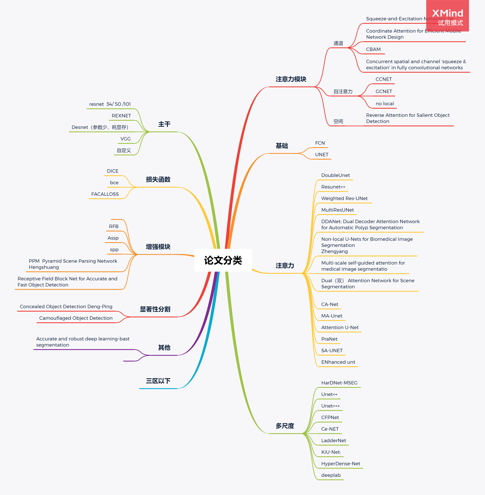

##介绍
个人的研究生期间研究记录，基于深度学习的图像分割，包括语义分割、医学分割。包含个人研究模型，代码
### 发表论文名称 ：
 BiDFNet:Bi-decoder and Feedback Network for Automatic Polyp Segmentation with Vision Transformers
### 代码以及实验数据：
将在中选后发出。

### 看过的论文 ：

### State-of-the-art Approaches  
1. "Selective feature aggregation network with area-boundary constraints for polyp segmentation." IEEE Transactions on Medical Imaging, 2019.
paper link: https://link.springer.com/chapter/10.1007/978-3-030-32239-7_34 
2. "PraNet: Parallel Reverse Attention Network for Polyp Segmentation" IEEE Transactions on Medical Imaging, 2020.
paper link: https://link.springer.com/chapter/10.1007%2F978-3-030-59725-2_26
3. "Hardnet-mseg: A simple encoder-decoder polyp segmentation neural network that achieves over 0.9 mean dice and 86 fps" arXiv, 2021
paper link: https://arxiv.org/pdf/2101.07172.pdf
4. "TransFuse: Fusing Transformers and CNNs for Medical Image Segmentation" arXiv, 2021.
paper link: https://arxiv.org/pdf/2102.08005.pdf
5. "Automatic Polyp Segmentation via Multi-scale Subtraction Network" MICCAI, 2021. paper link: https://arxiv.org/pdf/2108.05082.pdf
6. "CCBANet: Cascading Context and Balancing Attention for Polyp Segmentation" MICCAI, 2021. paper link: https://link.springer.com/book/10.1007/978-3-030-87193-2?noAccess=true
7. "Double Encoder-Decoder Networks for Gastrointestinal Polyp Segmentation" MICCAI, 2021. paper link: https://arxiv.org/pdf/2110.01939.pdf
8. "HRENet: A Hard Region Enhancement Network for Polyp Segmentation" MICCAI, 2021. paper link: https://link.springer.com/book/10.1007/978-3-030-87193-2?noAccess=true
9. "Learnable Oriented-Derivative Network for Polyp Segmentation" MICCAI, 2021. paper link: https://link.springer.com/book/10.1007/978-3-030-87193-2?noAccess=true
10. "Shallow attention network for polyp segmentation" MICCAI, 2021. paper link: https://arxiv.org/pdf/2108.00882.pdf

The latest trends in image-/video-based polyp segmentation refer to [AWESOME_VPS.md](https://github.com/GewelsJI/VPS/blob/main/docs/AWESOME_VPS.md).
